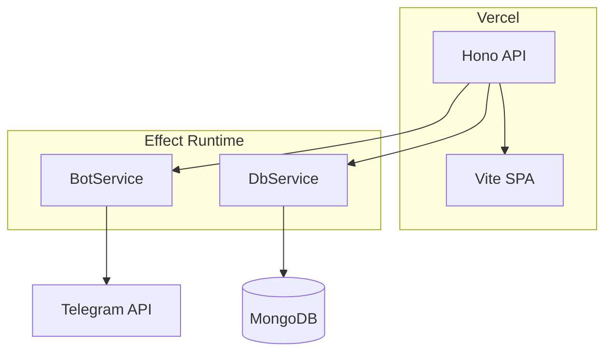

# Telegram Bot Template

## Stack

Node 22 · pnpm · TypeScript · Biome · Vite + React + Radix UI · Hono (Vercel serverless) · grammY · Effect TS · MongoDB

## Architecture

## Effect Style

- Alias `import { Effect as Fx, pipe } from "effect"`
- `pipe()` as the program spine — never `.pipe()` method chaining
- `Fx.Do` to start a pipe when the first step isn't an Effect
- Collect services at the top: `Fx.all({ db: DbService, bot: BotService })`
- Carry context forward: `Fx.map(effect, (val) => ({ ...ctx, val }))` to extend the pipe context
- Conditionals via `Fx.if` / `Fx.when` — never JS if/else/ternary inside pipes
- Sequencing: `Fx.flatMap(() => next)` — never `Fx.andThen`
- Guard/short-circuit: `Fx.when(Fx.succeed(ctx), () => condition)` + `Fx.flatten`
- One exported function per handler — extract pure helpers outside only when reused across files

## Documentation Guidelines

- Only document what is NOT deducible from code or framework docs
- Never duplicate framework documentation
- AGENTS.md files contain only: rules, constraints, patterns, and non-obvious conventions
- Code examples in docs must be minimal skeletons showing the pattern
- README covers only setup steps not figurable from the codebase
