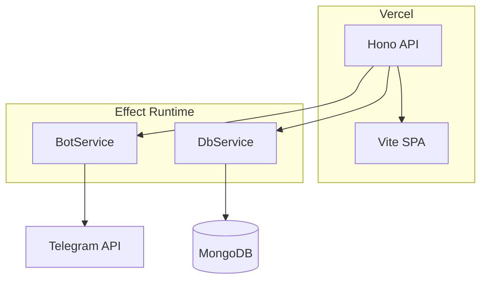

# Telegram Bot Template

## Stack

Node 22 · pnpm · TypeScript · Biome · Vite + React + Radix UI · Hono (Vercel serverless) · grammY · Effect TS · MongoDB

## Architecture

## Documentation Guidelines

- Only document what is NOT deducible from code or framework docs
- Never duplicate framework documentation
- AGENTS.md files contain only: rules, constraints, patterns, and non-obvious conventions
- Code examples in docs must be minimal skeletons showing the pattern
- README covers only setup steps not figurable from the codebase
